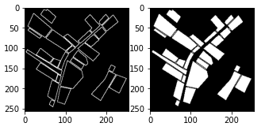
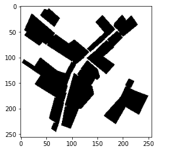

# NASA Harvest Field Boundary Detection Challenge

7th rank solution to classify crop field boundaries using multispectral observations collected by PlanetScope. Fields are located in Rwanda’s Eastern Province (Intara y’lburasirazuba) and spread over the districts of Gatsibo and Nyagatare. 

  

## Hardware Requirements

|Inferencing|Training|
|-----------|--------|
|4 GB RAM | 16 GB RAM|
